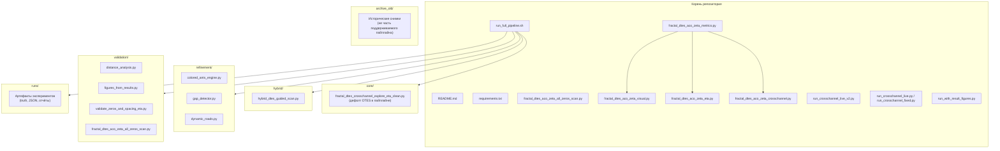
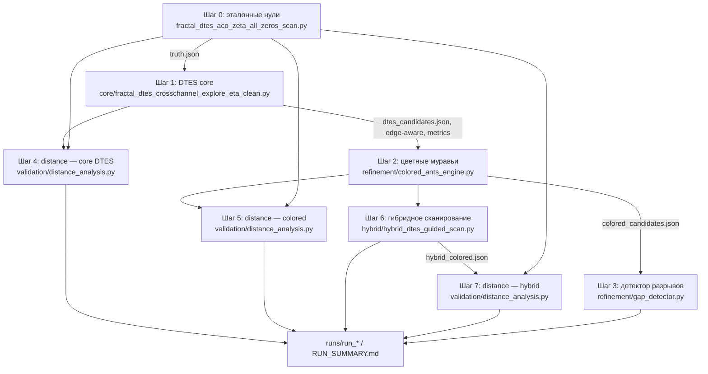
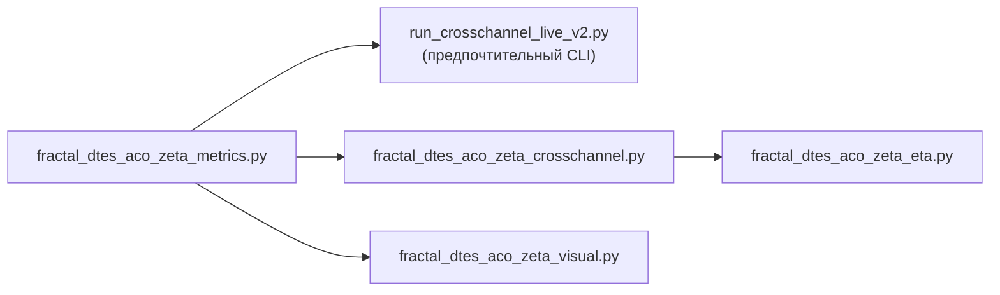
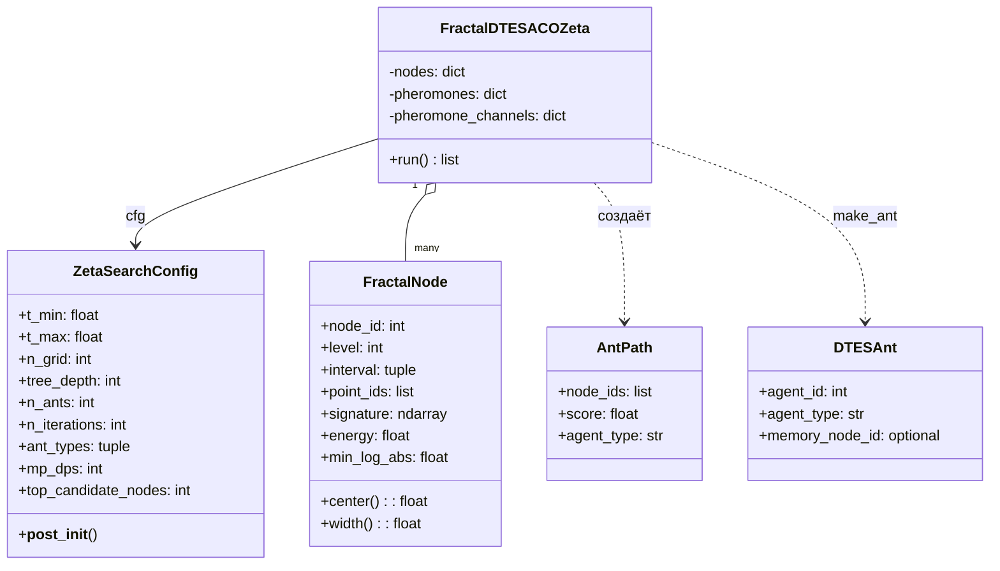
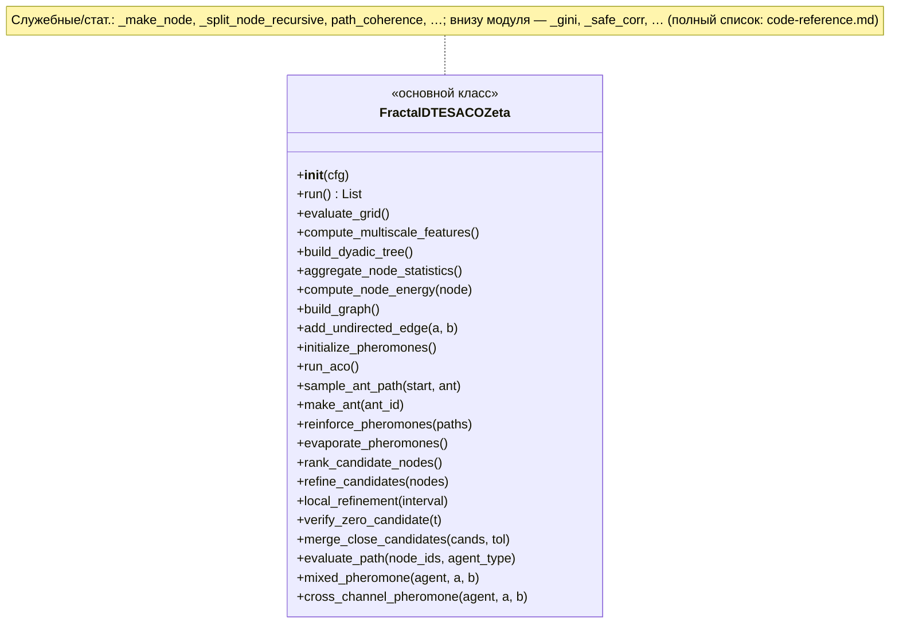
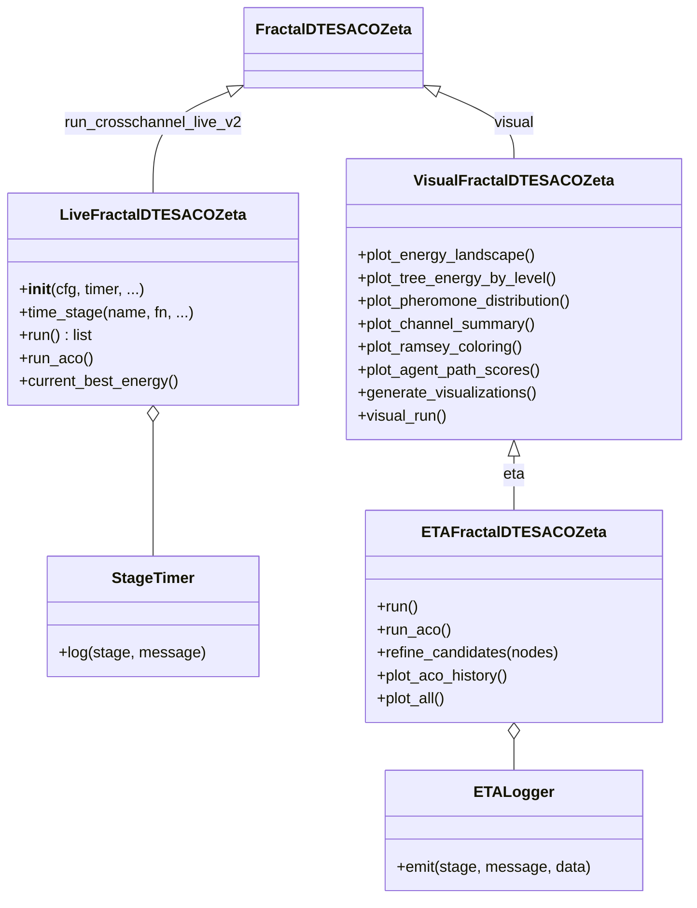
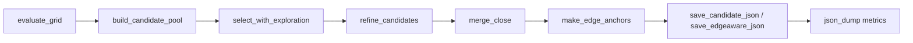
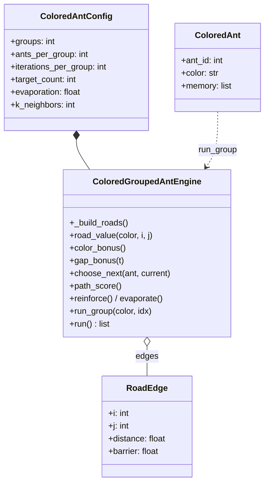

# Ant-RH — архитектура репозитория

Ниже — обзор модулей и типичного потока данных (полный пайплайн через [`run_full_pipeline.sh`](../../run_full_pipeline.sh)). **Таблицы по функциям и методам** вынесены в [code-reference.md](code-reference.md).

## Структура каталогов и роли

## Поток полного пайплайна (`run_full_pipeline.sh`)

## Альтернативный трек: полный Fractal + ACO (вне `run_full_pipeline.sh`)

## `fractal_dtes_aco_zeta_metrics.py` — модель данных

> `ZetaSearchConfig` — большой набор весов (энергия, барьеры, pheromone, cross-channel, `w_*`, `lambda_*`, `gamma_*` и т.д.); в диаграмме перечислены только «якорные» поля.

## `FractalDTESACOZeta` — методы по этапам (метрики + ACO)

Полная таблица категорий/методов `FractalDTESACOZeta` и заметка о дубликате в `fractal_dtes_aco_zeta_crosschannel.py` — [code-reference: FractalDTESACOZeta](code-reference.md#fractaldtesacozeta).

## Наследование: live runner, визуализация, ETA

`run_crosschannel_live_v2`: `make_edge_anchors`, `clean_candidates`, `save_candidates`, `save_metrics`, `main`.

`run_crosschannel_live` (v1) — близкие `StageTimer` / `LiveFractalDTESACOZeta` / `add_edge_anchors` (другой JSON метрик).

## `core/fractal_dtes_crosschannel_explore_eta_clean.py` — сетка без дерева/ACO

Сетка, отбор кандидатов и JSON (класс `Timer`, перечень функций): [code-reference: Core module](code-reference.md#core-module).

## `refinement/colored_ants_engine.py`

Модульные: `load_points`, `save_candidates`, `main`.

`refinement/dynamic_roads.py` — только **текстовая спецификация** формул R_t^color; исполняемой логики нет (см. комментарий в файле).  
`refinement/gap_detector.py`: `load_ts`, `main` — детекция больших зазоров в отсортированных кандидатах.

## `hybrid/hybrid_dtes_guided_scan.py`

Окна, скан по Hardy Z, класс `ETA`, CLI: [code-reference: Hybrid module](code-reference.md#hybrid-module).

## `validation/`

- Сравнение с эталоном и эталонный скан: [Validation distance](code-reference.md#validation-distance) (включает цепочку `distance_analysis` и `all_zeros_scan`).
- Рисунки из JSON-метрик: [Validation figures](code-reference.md#validation-figures).
- Внешняя проверка нулей/шага: [Validation ETA](code-reference.md#validation-eta).

---

Детали модулей и форматов данных: [`repository-layout.md`](../repository-layout.md), [`pipeline-and-algorithms.md`](../pipeline-and-algorithms.md).
