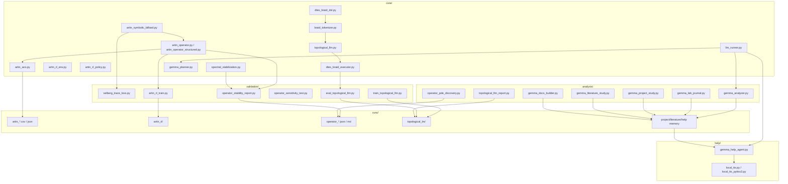
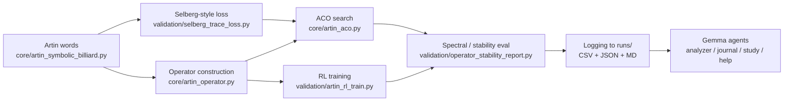
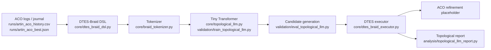
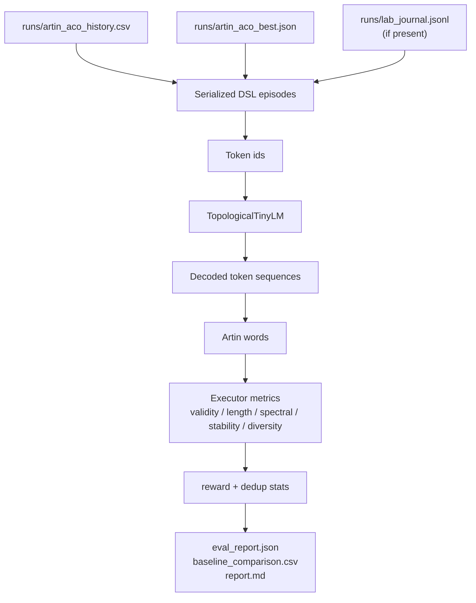
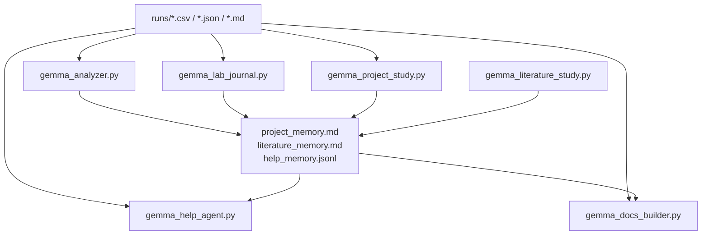
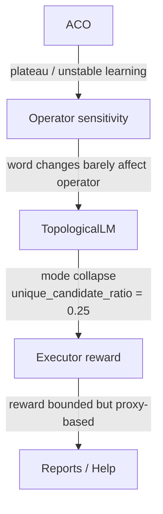

# Ant-RH — актуальные диаграммы

Ниже собраны актуальные схемы по текущему состоянию репозитория: основной пайплайн, расширение через TopologicalLM, поток данных и место Gemma-агентов. Диаграммы отражают реальное состояние системы, включая слабые места: plateau в ACO, низкую чувствительность оператора и mode collapse в TopologicalLM.

## 1. Архитектура репозитория

## 2. Основной пайплайн Ant-RH

## 3. Расширенный пайплайн TopologicalLM

## 4. Поток данных

## 5. Контур Gemma-агентов

## 6. Диаграмма проблемных мест

## 7. Ключевые наблюдения

- ACO сейчас не показывает устойчивого улучшения.
- Оператор численно стабилен, но слабо реагирует на изменение Artin words.
- TopologicalLM умеет генерировать валидные кандидаты, но diversity низкая.
- Исполнитель TopologicalLM стал стабильнее по reward, но это всё ещё proxy-оценка.
