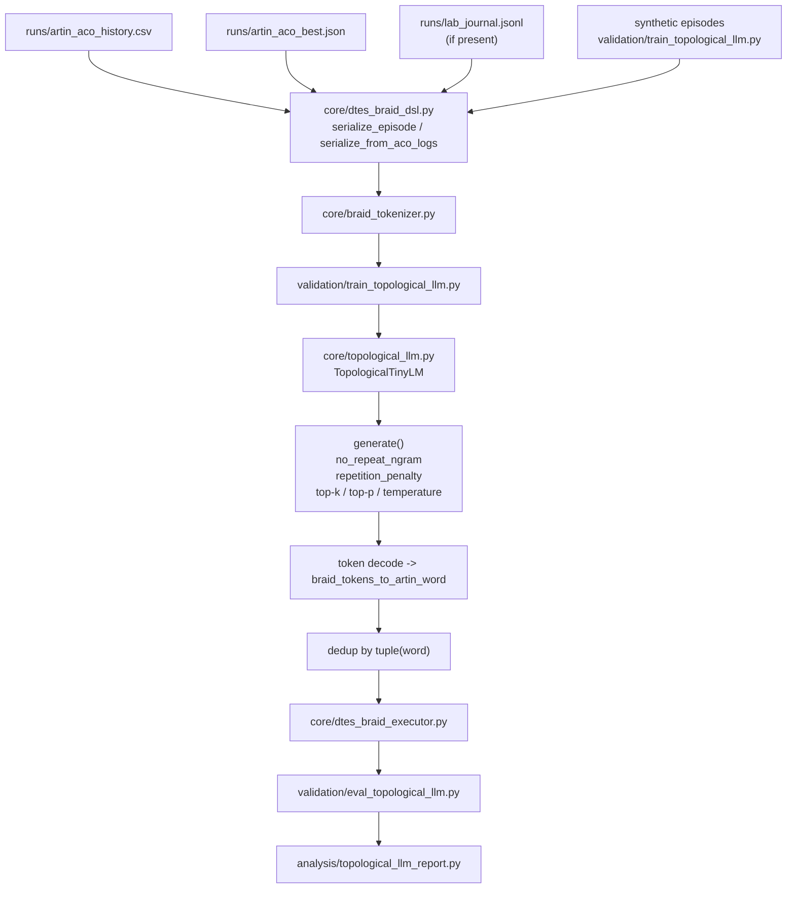
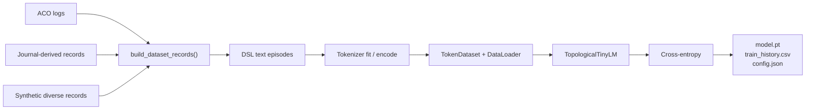
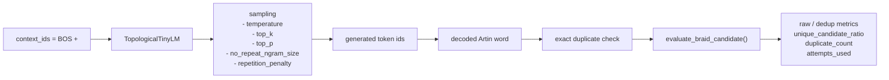
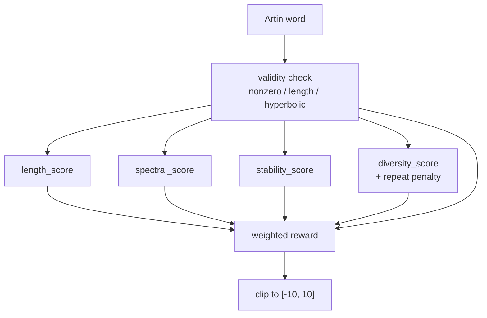
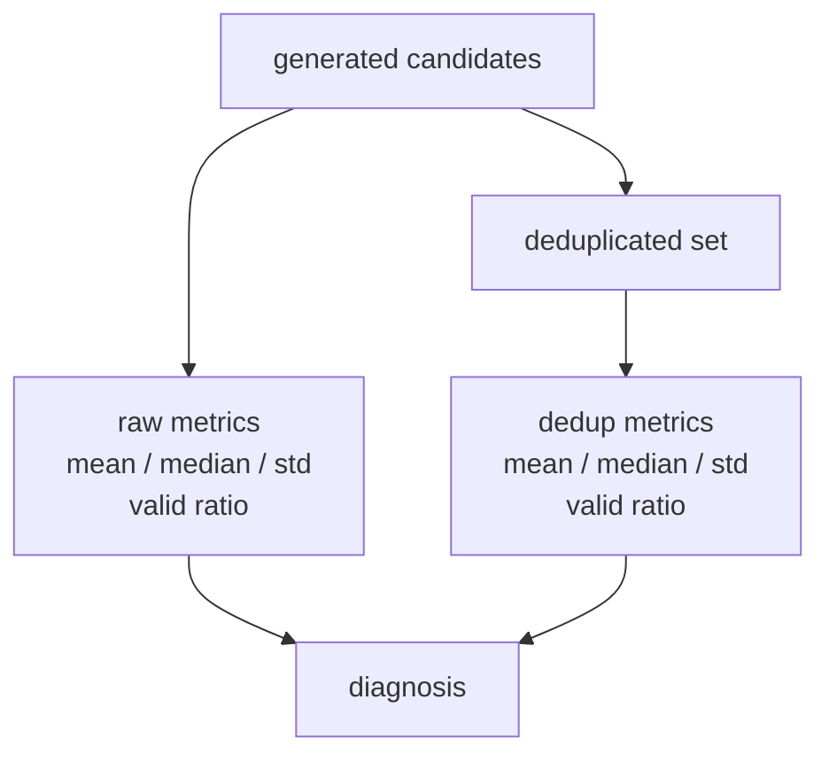
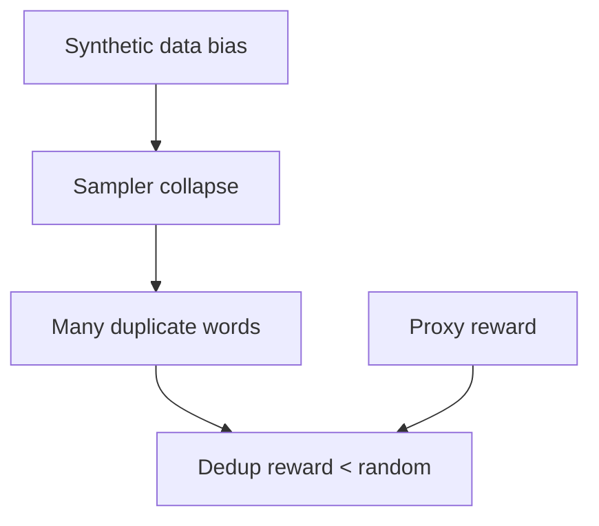

# TopologicalLM — детальная диаграмма

Этот файл выделяет только ветку TopologicalLM внутри Ant-RH: от построения датасета до отчёта по raw/dedup метрикам.

## 1. Полный контур TopologicalLM

## 2. Контур обучения

## 3. Контур генерации и оценки

## 4. Внутри executor

## 5. Raw vs dedup отчётность

## 6. Текущие проблемные места

## 7. Текущее состояние по последнему отчёту

- Raw valid generation работает.
- `unique_candidate_ratio = 0.25`.
- `duplicate_count = 150`.
- Raw mean reward положительный, но dedup mean reward отрицательный.
- В dedup-сравнении модель хуже random baseline.
- Основная проблема сейчас: mode collapse вокруг узкого семейства слов.
